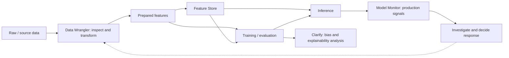

# Conceptual ML lifecycle diagram

```mermaid
flowchart LR
    A[Raw / source data] --> B[Data Wrangler: inspect and transform]
    B --> C[Prepared features]
    C --> D[Training / evaluation]
    C --> E[Feature Store]
    E --> D
    E --> F[Inference]
    D --> F
    D --> G[Clarify: bias and explainability analysis]
    F --> H[Model Monitor: production signals]
    H --> I[Investigate and decide response]
    I -.-> B
```

This diagram is a **conceptual combination** of topics in all three presentations. It is not a deployed system diagram.
